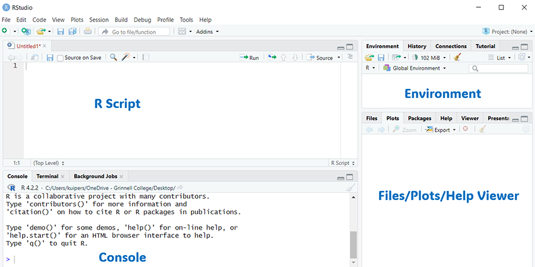

```{r setup, include=FALSE}
library(learnr)
library(dplyr)
y <- c("1","twelve","123")
x <- as.numeric(y)
vec.1 <- c("Blue", "Blue", "Red", NA ,"Blue")
vec.2 <- c(25, NA, 14, 17, 8)
DF <- data.frame(x = vec.1, y = vec.2)
my_data <- read.csv("https://raw.githubusercontent.com/skuiper/GrinnellDataScience/master/data/IowaCityHomeSales.csv")

mons <- c("March", "April", "January", "November", "January", "September",
          "October", "September", "November", "August", "January", "November",
          "November", "February", "May", "August", "July", "December",
          "August", "August", "September", "November", "February", "April")
```


## Installing `R` and `RStudio`

There are many benefits to installing `R` and `RStudio` on your computer. `RStudio` is an Integrated Development Environment (IDE) for `R`. Installing `RStudio` makes programming in `R` much easier! `R` and `Rstudio` are open-source software and completely free to download and use.

To get `RStudio` on your personal computer you need to:

1. Download and install `R` from [https://cloud.r-project.org/](https://cloud.r-project.org/)
2. Download and install `RStudio` from [https://posit.co/download/rstudio-desktop/](https://posit.co/download/rstudio-desktop/)

Several videos have been produced that share basic information on `R`  and `RStudio`. Below are two videos that provide information about installing `R` and `RStudio`.

#### Installing `R`


#### Installing `RStudio`


## The Layout of `RStudio`

When you open `RStudio` the first thing you'll want to do is open a file to work in. You can do so by navigating to: File $\rightarrow$ New File $\rightarrow$ `R` Script. This will open a new window in the top left of the `RStudio` user interface for you to work in. At this point you should see four panels:

1. Your *`R` Script* (top left)
2. The *Console* (bottom left)
3. Your *Environment* (top right)
4. The *Files/Plots/Help Viewer* (bottom right)

\ 


\  

An *`R` Script* is similar to a text file and stores your code while you work on it.  At any point you can send some or all of the code in your *`R` Script* to the *Console* for the computer to execute. To do so, simply highlight the code and hit *Ctrl-Enter*; you should see the code that you ran appear in the *Console*, along with the response generated by the code. You can also type commands directly into the *Console*. The *Console* will echo any code you tell it to run and display any textual/numeric output that the code generates.

The *Environment* shows you the names of datasets, variables, and user-created functions that have been loaded into your workspace and can be accessed by your code. The *Files/Plots/Help Viewer* will display graphics generated by your code and a few other useful entities (like help documentation and file trees). On the Grinnell `RStudio` Server it will also allow you to conveniently access files (such as labs or data sets) that are stored on the server.

## Packages

To facilitate more complex tasks in `R`, people have developed their own sets of functions known as *packages*. If you are working on your own computer, and with a new package for the *first time*, then the package must be installed. You can install packages from the console by typing the following command:

`install.packages("package name")`


```{r, eval = FALSE}
install.packages("mosaic")
```

Once a package is installed it needs to be loaded into your `R` session by using the `library` function (or the `require` function):

```{r, message = FALSE, warning = FALSE}
library(mosaic)
fav_stats(1:100)  # fav_stats is a function in the mosaic package
```

**Important Notes**

- You'll need to re-load a package *every time* you open `RStudio`, but you'll *only need to install the package once*.

- There are many functions that work in `base R`, the basic software which contains the R programming language. However, anyone can create a `R package` which typically contain functions and data sets. There are more than 10,000 packages available. Be careful about using any packages, since some may not be well documented or well maintained. In these tutorials, we will focus on using the [mosaic package](https://cran.r-project.org/web/packages/mosaic/vignettes/MinimalRgg.pdf) which is designed for introductory courses and packages from the [tidyverse](https://www.tidyverse.org/). This packages in the tidyverse tend to be well-maintained, well-documented, efficient, and popular packages.

- Some similar functions exist in multiple packages. For example the `mean` function exists in `base R`, but it may have issues with missing data. However, the `mean` function from the `mosaic package` automatically takes missing data into account. If you `require` a specific package, you will typically use the function from that package. It is also possible to require a function from a specific package.


## RMarkdown

Almost all of the work we do will be written using `RMarkdown` files.


`RStudio` supports many types of files, some of which some of which use the “Markdown” authoring framework. An `RMarkdown` file conveniently allows you to both:

1. Write and execute `R` code
2. Generate high quality, reproducible reports that can be shared with an audience

To use `RMarkdown`, you’ll need the `rmarkdown` package:

```{r, eval = FALSE}
install.packages("rmarkdown")
library("rmarkdown")
```

Once you have the package installed and loaded, you can create a new `R` Markdown file by selecting: File $\rightarrow$ New File $\rightarrow$ `R` Markdown. 

At the top of the document is the **header** (or YAML):

- The header is initiated by three '-' characters and closed by another three '-' characters.
- It contains the title, author, etc. that will appear at the top of the document created by your code
- You can use it to add elements like a table of contents, page numbers, etc.

The second thing you'll see is a **code chunk**:

- Code chunks are initiated by $\text{```\{r\}}$ and closed by $\text{```}$.
- The $\text{```}$ wrappers tell `R` Markdown that what appears inside is code that should be executed. The first code chunk (immediately after the header), is initiated by $\text{```\{r setup\}}$ and sets up options that will be used when executing your `R` code throughout the document. For example, a document might import all required packages here. For now, you should keep this chunk as it appears and place your actual code inside of other code chunks.
- You can place code chunks anywhere throughout the document by placing the wrapper (initiated by $\text{```\{r\}}$ and closed by $\text{```}$) where ever needed.
- You can execute the `R` code in a chunk by clicking the small green arrow in the upper right corner. Alternatively, you can highlight individual code pieces and execute them using *Ctrl-Enter*.

Next you'll see **section headers**:

- Section headers are created using strings of the $\#$ character.
- The number of $\#$ characters determines the level (size) of the header.
 
Finally, `R` Markdown allows you to type **ordinary text** outside of code chunks. Thus, you can easily integrate written text into the same document as your code and its output.

The primary purpose of `R` Markdown is to create documents that blend `R` code, output, and text into a polished report. To generate this document you must compile your `R` Markdown file using the “Knit” button (a blue yarn ball icon) located towards the upper left part of your screen.


The information in the prior section provides a minimally sufficient introduction to `R` Markdown. You can learn much more by going through the lessons created by `R` Markdown’s developers at [https://rmarkdown.rstudio.com/lesson-1.html](https://rmarkdown.rstudio.com/lesson-1.html) if you have the time. These lessons include numerous screen shots, videos, and more detailed explanations of exactly how `R` Markdown works and its capabilities. 


## Missing Data

Real data sometimes contain **missing values**, which `R` stores as the special element `NA`. Missing values may be present in your raw data, but they can also be introduced by coercion or other operations/functions. **Coercion** is when the `as.` family of functions are used to change the data type. This example follows the same procedure as before, but replaces one of the character strings with a non-numeric string:

```{r missingdata1, exercise = TRUE}
y <- c("1","twelve","123") # the second element is no longer a character string of numbers
class(y)
x <- as.numeric(y)         # coerce 'y' into a vector of numeric values
x
class(x)
```

Missing values can cause problems for many functions, but some functions have arguments that control how missing values are handled. The example below shows how to remove any missing values when calculating the mean of `y`:

```{r missingdata2, exercise = TRUE}
mean(x)               # the operation fails due to the missing value
mean(x, na.rm = TRUE) # completes the operation by removing the missing value
```

Another useful function is `na.omit`, which will subset a data frame to remove any rows that contain missing data in any variable. This function is demonstrated on the Happy Planet data below:

```{r missingdata4, exercise = TRUE}
head(DF)
DF_without_na <- na.omit(DF)  # creates a new data frame consisting of the subset without missing data
head(DF_without_na)
dim(DF)                       # compare the dimensions of the two data frames
dim(DF_without_na)
```

## Ordering Factor Variables

Many functions will coerce character variables into **factors**.

On the surface you might not notice any difference, but internally a factor relies upon a set of categorical labels known as *levels*. By default, these labels are ordered alphabetically, but in some circumstances you’ll want to organize them yourself.

```{r factorvariables1, exercise = TRUE}
# create a vector containing a random list of different months
mons <- c("March", "April", "January", "November", "January", "September",
          "October", "September", "November", "August", "January", "November",
          "November", "February", "May", "August", "July", "December",
          "August", "August", "September", "November", "February", "April")

barplot(table(mons)) # notice how the barplot defaults to alphabetical order
```

```{r factorvariables2, exercise = TRUE}
# reorder into a new factor with ordering specified by the "levels" argument
mons_ordered = factor(mons,
                      levels= c("January", "February", "March", "April", "May", "June",
                                "July", "August", "September", "October", "November", "December"), 
                      ordered = TRUE)

barplot(table(mons_ordered)) # notice the new ordering (useful for data visualization!)
```


## Modifying a Data Frame

After finding a data set, it can be very time consuming to clean and organize the data to get it into a format that allows us to apply statistics or data science techniques. In this section we will provide a few examples.

### Subsetting

When examining a dataset, scenarios often arise where a user wishes to evaluate data that satisfy certain logical conditions. For example, suppose a user wants to know which elements of IowaCityHomeSales represent houses sold for more than \$200,000. A simple examination of the data indicates that the column 'sale.amount' represents the price. We can then use a logical operator to compare the values in this column with the desired amount.

```{r eval = FALSE}
library(dplyr)
```


```{r LC1, exercise = TRUE}
# use functions from the dplyr package (from the tidyverse) to subset a data frame
# The filter function subsets our data to only rows that satisfy our condition (sale.amount > 200000) 
names(my_data)
dim(my_data)

my_data2 <- filter(my_data, sale.amount > 200000) 
dim(my_data2)
```


Logical conditions are particularly useful for subsetting objects. This example creates a new data frame containing all homes that sold for more than $500,000 *and* have living areas over 3,000 square feet:


```{r logicalsubset1, exercise = TRUE}
names(my_data)
large_and_expensive <- filter(my_data, sale.amount > 500000, area.living > 3000)
dim(large_and_expensive)
```


### Logical Operators

These are the logical operators used to evaluate logical conditions:

Operator      | Description
------------- | ------------------------------------
`==`          | equal to
`!=`          | not equal to
`>`           | great than
`>=`          | greater than or equal to
`<`           | less than
`<=`          | less than or equal to
`&`           | and
`|`           | or
`!`           | negation/not


The example creates a new object containing all homes that don't have a basement *or* don't have air conditioning:

```{r logicalsubset2, exercise = TRUE}
no_bsmt_or_no_ac <- filter(my_data, bsmt == "None" | ac != "Yes")
dim(no_bsmt_or_no_ac)
```

## Creating a New Variable

The `mutate` function, from the dplyr package, is a very useful command that allows us to create new variable.


```{r mutate1, exercise = TRUE}

my_data3 <- mutate(my_data, houseage = 2024 - built, totalarea = area.base + area.living)

names(my_data)
names(my_data3)
```

Remarks

 - After specifying the data frame, give the name of the new variable and it’s definition. Notice that we need to use = to assign the value of the new variable.

- To add multiple variables at once, separate the list of new variables by commas. 

## On Your Own

##### **Directions:**

1. Create a new `R` Markdown file "IntroToR1b"..
2. Make sure the title of the document includes "Lab 1b" and "MyName".
3. Before typing any solutions, make sure your .Rmd file compiles (knits) and the formatting looks good. Never wait until your assignment is finished to verify a document will knit.
4. Write code blocks to address the following questions, label each block as "Question 1", "Question 2", etc. 
4. Submit the 1-2 page knitted html document that it generates.


##### **Question #1:**

Write code that requires the `mosaic` and `dplyr` packages. Then write code that reads in the data file "IowaCityHomeSales.csv" from GitHub. 

`https://raw.githubusercontent.com/skuiper/GrinnellDataScience/master/data/IowaCityHomeSales.csv`

##### **Question #2:**

Create a table that identifies the levels and and counts for the `occupancy` variable.

##### **Question #3:**

Write code that creates a new data frame, called FamilyHomes, that only include `101 (Single-Family / Owner Occupied)` homes. Use the `dim` command on this new data frame.

##### **Question #4:**

Write code that can be used to identify the number of 5 bedrooms homes in the FamilyHomes data frame.

##### **Question #5:**

Create a scatterplot that compares the sale.amount and the assessed value of the home. Describe the pattern you see.

##### **Question #6:**

Create a side-by-side boxplot of the sales.amount by the number of bedrooms (you should use code that looks like `sale.amount ~ as.factor(bedrooms)`). Describe the pattern you see.


## References and Resources

* See more tutorials at [Stat2Labs](https://stat2labs.sites.grinnell.edu/RTutorials.html).


