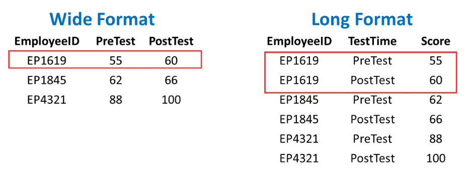

```{r setup, include=FALSE}
knitr::opts_chunk$set(echo = TRUE, warning = FALSE, message = FALSE, fig.height = 3)
```

```{r include=FALSE}
library(tidyverse)
```

## The tidyr package

This lab focuses on manipulating, cleaning, and preparing data for visualization (or other analyses) using packages from the [tidyverse suite](https://www.tidyverse.org/packages/).

### Motivation

Shown below are the acceptance rates over time of three different liberal arts colleges from 2018 to 2020:

```{r, echo = FALSE, out.width="100%"}
library(ggplot2)
adm = c(28.9, 24.4, 23.1, 21.2, 19.8, 19.1, 33.7, 36.2, 36.4)
year = rep(c(2018, 2019, 2020), 3)
coll = c(rep("Grinnell",3), rep("Carlton", 3), rep("Oberlin", 3))
df = data.frame(adm, year, coll)
ggplot(df, aes(x = year, y = adm, col = coll)) + geom_line() + geom_point() + theme_minimal() + 
  labs(x = "Year", y = "Percent Accepted", col = "College") + scale_x_continuous(breaks = 2018:2020, labels = c(2018,2019,2020))
names(df) = c("Adm_Rate", "Year", "College")
#write.csv(df, "C:\\Users\\Ryan M\\Documents\\Grinnell\\remiller1450.github.io\\data\\college_adm.csv", row.names = FALSE)
```

When working with data, you must be able to connect the *format* of your data and a desired data visualization.

1) If creating an excel spreadsheet from this graphic, how do you think *most people* would record the data?
2) How should the data be formatted to match the conventions of `ggplot`?


### Long vs. Wide Data

Data in a **wide format** record *many different values* or variables for a *single entity in a single row* (ie: acceptance rates for a college in different years, or different test scores for the same employee).

Data in a **long format** use *multiple rows* and a *single column* for the outcome or value of interest (ie: acceptance rate, test score, etc.) with additional columns identifying the meaning of that value.

Example:

```{r, echo=FALSE, out.width="120%", fig.align="center"}

```


The `ggplot2` package, as well as the implementations of many statistical models, expect data in **long format**. However, many data manipulations are easier to do in wide format; for example, calculating the average improvement from pre-test to post-test.


### Tidy Data

Converting between "wide" and "long" formats is often the most challenging step in creating a "tidy" data set, or one that is fully prepared for graphing/modeling.  

In general, **tidy data** are defined by the following criteria:

**1. Every column is a variable**
**2. Every row is an observation**
**3. Every cell is a single value**

This lab will introduce several data manipulation functions used to help tidy a data set into a more useful format.


### Packages and Datasets

This lab primarily uses `tidyr` package, which is used to "tidy" or reshape data. It will also use the `ggplot2` package.

```{r message = FALSE, warning = FALSE}
# Please install and load the following packages
# install.packages("tidyr")
library(tidyr)
library(ggplot2)
```

The lab will use several data sets in its examples:

```{r}
collegeAdm = read.csv("https://grinnell-statistics.github.io/Grinnell_R_Tutorials/data/college_adm.csv")
```

- **Description**: Admissions rates of three Midwestern liberal arts colleges according to [acceptancerate.com](https://www.acceptancerate.com/schools/grinnell-college)

```{r}
bluechips = read.csv("https://grinnell-statistics.github.io/Grinnell_R_Tutorials/data/bluechips.csv")
```

- **Description**: Closing prices on the first trading day of the year from 2010 to 2021 for four stocks that [The Motley Fool](https://www.fool.com/investing/stock-market/types-of-stocks/blue-chip-stocks/) calls "blue chip" investments.

```{r}
polls <- read.csv("https://grinnell-statistics.github.io/Grinnell_R_Tutorials/data/polls2016.csv")
```

- **Description**: Polling data leading up to the 2016 US Presidential Elections scraped from [RealClearPolitics.com](https://www.realclearpolitics.com/epolls/2016/president/us/general_election_trump_vs_clinton_vs_johnson_vs_stein-5952.html#polls)


## Lab

At this point you will begin working with your partner. Please read through the text/examples and make sure you both understand before attempting to answer the embedded questions.


### Pivoting between long and wide formats

Consider the `collegeAdm` data frame:

```{r}
head(collegeAdm)
```
These data are currently in "long" format, but we could convert them to a "wide" format using the `pivot_wider()` function:

```{r}
## Pivot from long to wide to get 1 row per Year
wideCollegeAdm <- pivot_wider(collegeAdm, 
                              id_cols = Year,
                              names_from = College, 
                              values_from = Adm_Rate)
head(wideCollegeAdm)
```

The following arguments guide this transformation:

- `id_cols` determines what will be given its own row in the "wide" data set (ie: each row will be a unique value of the variable "Year")
- `names_from` defines the *single column* from the "long" data that should be *spread into multiple distinct columns* in the "wide" data (ie: each value of "College" is given a column named after it)
- `values_from` defines the *single column* from the "long" data containing the *values used to populate the cells* of the "wide" data (ie: the columns created for each "College" will contain the values of "Adm_Rate")

Notice what happens when `id_cols` and `names_from` are swapped:

```{r}
## Pivot from long to wide to get 1 row per College
wideCollegeAdm2 <- pivot_wider(collegeAdm, 
                              id_cols = College,
                              names_from = Year, 
                              values_from = Adm_Rate)
head(wideCollegeAdm2)
```

Similarly, the `pivot_longer()` function will transform "wide" data into "long" data:

```{r}
pivot_longer(wideCollegeAdm2, 
             cols = !College, 
             names_to = "Year", 
             values_to = "Adm_Rate")
```

- `cols` defines the column(s) used in the pivot (`!College` will include everything but the variable "College"). The values of these variables will be collapsed into a single column.
- `names_to` is the name of the single column in the "long" data frame that will store the *column names* of the "wide" data frame
- `values_to` is the name of the single column in the "long" data frame that will store the *values* from the cells of the "wide" data frame

*Note* we could interchangeably use the argument `cols = c("2018", "2019", "2020")` or `cols = 2:4` (instead of `cols = !College`) to achieve the exact same result. The former approach explicitly names the columns that should be pivoted, and the later gives their index positions.

```{r, echo = FALSE, eval = FALSE}
pivot_longer(wideCollegeAdm2, 
             cols = c("2018", "2019", "2020"), 
             names_to = "Year", 
             values_to = "Adm_Rate")

pivot_longer(wideCollegeAdm2, 
             cols = 2:4, 
             names_to = "Year", 
             values_to = "Adm_Rate")
```

**Question #1**: Convert the `bluechips` data to a long format where each stock's closing price on the first trading day of each year is recorded in a single column named "Price".

**Question #2**: Starting with the long format data frame you created in Question #1, recreate the original `bluechips` data set using `pivot_wider()`.


### Other `tidyr` functions

Pivoting or reshaping is often only one of many steps needed to tidy a data set. Another common occurrence is that data will contain multiple variables in a single column. For example, consider the "Date" and "Sample" columns in the `polls` data set:

```{r}
head(polls)
```

The column "Date" contains two distinct variables, the start and end of the poll's sampling period. Similarly, "Sample" also contains two variables, the number of participants in the poll and the population that was sampled (registered voters or likely voters).

The `separate()` function is used to split a column into multiple new columns using a defined separator:

```{r}
## Example #1
tidy_polls <- separate(polls, 
                       col = Date, 
                       into = c("Begin", "End"),
                       sep = " - ")
head(tidy_polls)
```

- `col` is the single column to be separated
- `into` indicates the names of the new columns produced by the separation
- `sep` is the character string used to determine how to split. In this example, the split happens when `-` surrounded by a space on each side is present.

In Example #2 (shown below), the "sep" argument is not explicitly given. In this situation, the default behavior of `separate()` is to try and guess an appropriate separator. 

```{r}
## Example #2
tidy_polls <- separate(polls, 
                       col = Sample, 
                       into = c("Size", "Population"))
head(tidy_polls)
```

While this is not generally recommended, it can work well if there's a clear pattern in your variable. More complex strings might require the use of *regular expressions*, a topic we'll cover later this semester.

**Question #3 (Part A)**: Using either the `pivot_longer()` or `pivot_wider()` function, create a version of the "tidy_polls" data containing the variables "Candidate" and "Percentage", where "Candidate" is taken from the names of the last four columns of the data frame, and "Percentage" is taken from the values contained in these columns.

**Question #3 (Part B)**: Using the `separate()` function, split the column "Candidate" (created in Part A) into two distinct columns containing the name of the candidate (ie: Clinton, Trump, etc.) and their political party (ie: D, R, etc.). *Hint*: periods, or `.`, are a special character in `R`, but you can reference one using the expression: `[.]`. You can also try letting `separate()` guess the proper splitting characters.


### Practice

**Question #4**: The "airlines" data set (loaded below) contains data used in the article [Should Travelers Avoid Flying Airlines That Have Had Crashes in the Past?](http://fivethirtyeight.com/features/should-travelers-avoid-flying-airlines-that-have-had-crashes-in-the-past/) that appeared on fivethirtyeight.com.

```{r}
airlines <- read.csv("https://grinnell-statistics.github.io/Grinnell_R_Tutorials/data/airline-safety.csv", as.is = TRUE)
head(airlines)
```

Recall that a "tidy" version of these data should satisfy the following:

- Each row is a single airline in a specific time period (ie: Air Canada in 1985-1999 or Alaska Airlines in 2000-2014)
- Each column contains only a single variable
- Each cell contains only a single value

**Part A**: Use `pivot_longer()` to gather the last six columns of the "airlines" data into a column named "accidents" and a column named "count".

**Part B**: Use `separate()` to split the "accidents" column into two variables named "var" and "years". *Hint*: remember that the period is a special character in `R`.

**Part C**: Use `pivot_wider()` to spread out the "var" column into three new columns containing the type of accident. Your data should now contain two rows per airline (one for each time period), you can check if the first few rows match those printed below.

```{r, echo = FALSE, eval = TRUE}
## Part A
tidy_airlines <- pivot_longer(airlines, cols = !c(airline, avail_seat_km_per_week), names_to = "accidents", values_to = "count")

## Part B
tidy_airlines <- separate(tidy_airlines, col = "accidents", into = c("var", "years"), sep = "[.]")

## Part C
tidy_airlines <- pivot_wider(tidy_airlines, id_cols = c(airline, avail_seat_km_per_week, years), names_from = var, values_from = count)
head(tidy_airlines)
```


**Question #5**: The `iris` data (from the `datasets` package) is a collection of measurements (in cm) of the the sepal and petal dimensions of 50 different flowers coming from 3 different species of iris. These data are frequently attributed to the famous statistician [Ronald Fisher](https://en.wikipedia.org/wiki/Ronald_Fisher)

```{r}
# install.packages("datasets")
data(iris)
```

Your goal in this question is to recreate the following graphic, which requires the use of `tidyr` functions covered in this lab.

```{r, echo = FALSE}
## Pivot longer
long_iris = pivot_longer(data = iris, cols = -Species, names_to = "Measures", values_to = "Values")

## Split var names
long_iris_split = separate(long_iris, col = Measures, into = c("Part", "Measure")) 

## Plot
ggplot(data = long_iris_split, aes(Species, Values, color = Part)) + 
    geom_point() + 
    facet_grid(cols = vars(Measure)) +
    theme(axis.text.x = element_text(angle = 45))
```

- *Note*: you can use the `theme()` function with the argument `axis.text.x = element_text(angle = 45)` to rotate the x-axis labels.
